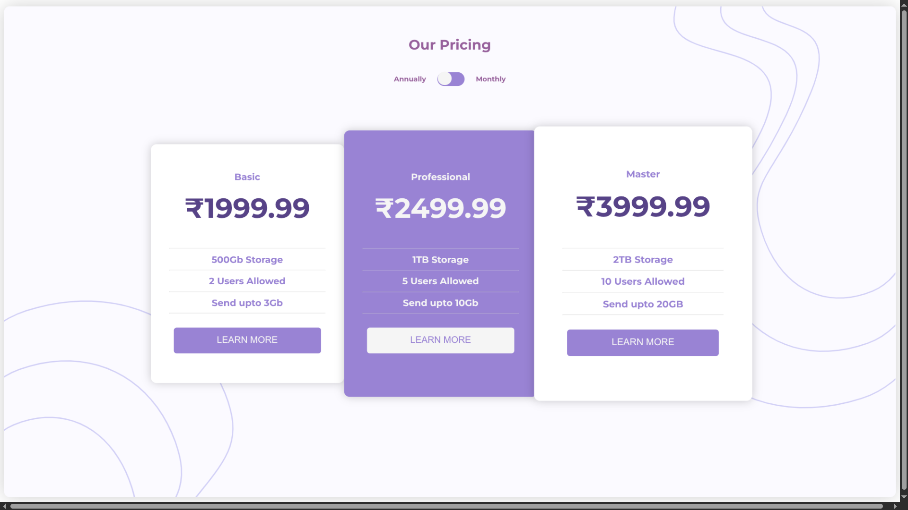

# Pricing Page

A clean, responsive static pricing page built with HTML, CSS, and JavaScript. Along with an animation effect.

## Project Overview

This project is a simple pricing page prototype that displays three subscription plans: Basic, Professional, and Master. It includes a toggle switch that switches prices between annual and monthly billing modes.

## Features

- Static landing page layout using semantic HTML
- Responsive card-style pricing options
- Animated toggle switch to switch between annual and monthly pricing
- Custom styles using a modern font and gradient-inspired colors
- Decorative SVG background assets loaded from the `data/` folder

## How to Run

1. Open the project folder in your VS code editor.
2. Open `index.html`.
3. Click on Live server to host it on your machine.

## How It Works

- The page renders three pricing cards with set values for each plan.
- A checkbox is used as a custom toggle switch in the header section.
- The default view shows annual pricing. When switched on, the monthly pricing values appear.

## Preview

## License

This project is open for personal use and modification.
